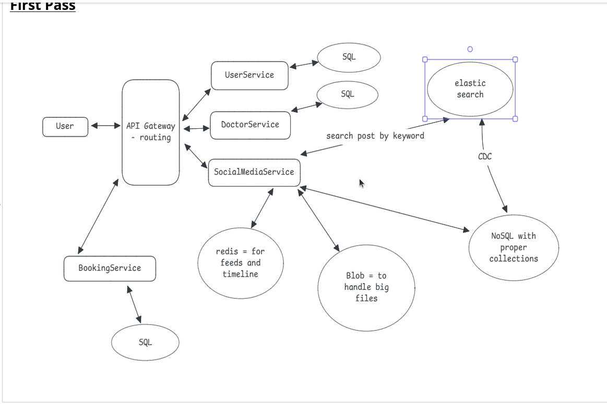
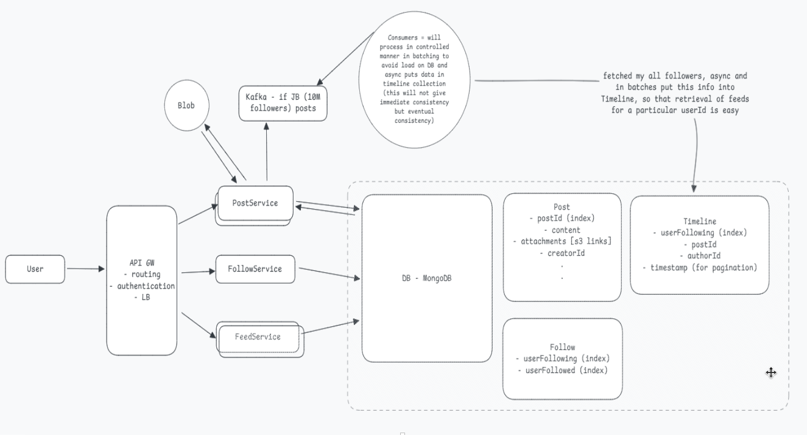

# MindConnect - (Microservices Project)
Social Media & Doctor Booking Modules

⚠️ Note: This is a microservices-based project. Each microservice has its own repository. Links to the actual repos are provided below.

# Overview

Social Media Module is a high-scale social media and docter consultation platform built as part of the larger MindConnect project.  
This module focuses on Post, Feed, and Follow microservices, designed for millions of users with low-latency and high-throughput requirements.

# Microservices & Repositories

Each microservice is independent and maintained in its own repository:  
| Service       | Description                                | GitHub Link |
|---------------|--------------------------------------------|------------|
| Post Service  | Handles creation, updates, and storage of user posts | [Link](https://github.com/VedantRathor/PostService) |
| Feed Service  | Generates user timelines efficiently using Kafka fan-out | [Link](https://github.com/VedantRathor/FeedService) |
| Follow Service| Manages follower/following relationships and notifications | [Link](https://github.com/VedantRathor/FollowService) |

> Each repo includes setup instructions and can be run independently.

# Architecture & Key Highlights

- Communication: gRPC + REST for inter-service calls  
- High-scale fan-out: Processed 5M followers in 7–9 minutes using Kafka (5 partitions, 6 consumers)  
- Batching & Parallelism: Batches of 2,000 followers for efficient fan-out  
- Database Rate-Limiting: MongoDB writes capped at 10K ops/sec using Guava Leaky Bucket  
- Resilience & Throughput: Multi-threaded producers and parallel consumers handle peak traffic smoothly

## High-Level Architecture
The system consists of multiple modules: UserService, DoctorService, SocialMediaService, BookingService, API Gateway, and supporting databases/storage.  

## Social Media Microservices Architecture
This diagram details the **Post, Feed, and Follow microservices** including Kafka fan-out, MongoDB schema, and timeline batching.  

# Design Notes & Thought Process

- [Link](https://1drv.ms/o/c/c078c29098d8248b/EgFaVJUw6pNMqYhfiW_sxJMBGGsXQTzKGeZGgehHPwgyRw?e=H6wmoz) – Contains design decisions, approaches, and notes on building scalable microservices  
- Demonstrates system design thinking, planning, and experimentation before implementation

