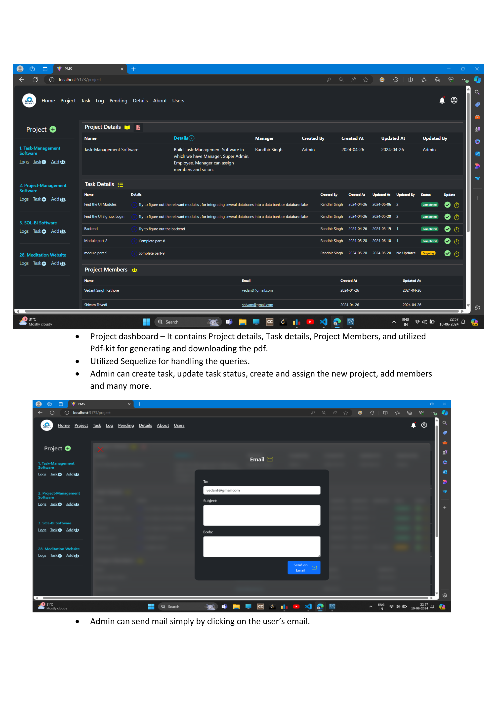

# Project Management System (PMS Portal)

## Tech Stack
- **Database:** MySQL  
- **Backend:** Node.js, Express  
- **Frontend:** React  
- **ORM:** Sequelize (with migrations, seeders, and schema associations)  
- **Other:** WebSockets, JWT for performance and real-time updates  

---

## Project Overview
PMS Portal is a full-stack project management system designed to streamline team collaboration and task tracking. It supports multiple user roles and provides analytics and reporting for better decision-making.

---

## Key Features
- **User Roles:** Admin, Manager, Employee — each with tailored access permissions.  
- **Project Management:** Assign projects, create tasks, track progress with logs, manage updates, and more.  
- **Performance Optimization:** Worker-thread modules for handling concurrent users efficiently.  
- **Real-Time Updates:** Dynamic component refreshes for live data changes.  
- **Database Schema & Joins:** Complex Sequelize relationships and efficient queries for scalable data management.  

---
  
- [GitHub Repository](https://github.com/VedantRathor/PMS-Portal)  

---

## Notes
- Previously deployed full-stack on **AWS (App Runner, RDS, S3)**.  
- Optimized JSON (2000+ lines) and built a high-efficiency 10-year Excel report.  

